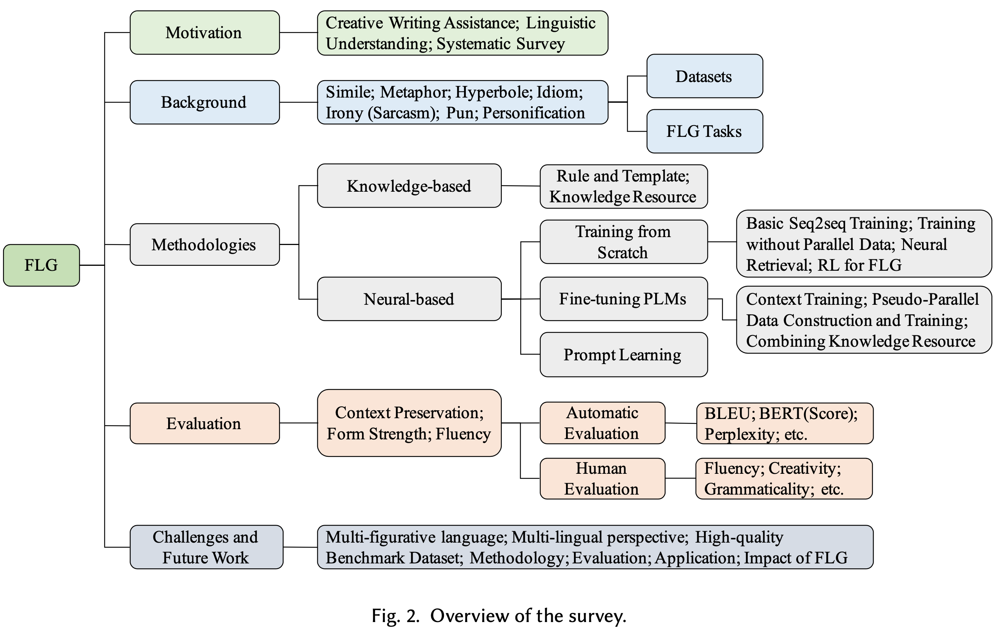

# A Survey on Automatic Generation of Figurative Language: From Rule-based Systems to Large Language Models

<h2 id="0">Abstract</h2>

<tr>
Figurative language generation (FLG) is the task of reformulating a given text to include a desired figure of speech, 
such as a hyperbole, a simile, and several others, while still being faithful to the original context. This is a fundamental, 
yet challenging task in Natural Language Processing (NLP) to achieve ever more natural text generation, 
which has recently received increased attention due to the promising performance brought by pre-trained language models. 
Our survey provides a systematic overview of the development of FLG, mostly in English, starting with the description of some common figures of speech, 
their corresponding generation tasks and datasets. We then focus on various modelling approaches and assessment strategies, 
leading us to discussing some challenges in this field, and suggesting some potential directions for future research. 
To the best of our knowledge, this is the first survey that summarizes the progress of FLG including the most recent development in NLP. 
We also organize corresponding resources, e.g., paper lists and datasets, and make them accessible in an open repository. 
We hope this survey can help researchers in NLP and related fields to easily track the academic frontier, providing them with a landscape and a roadmap of this area.
</tr>

<h2 id="1">Survey Overview</h2>

<h2 id="2">Datasets & Benchmarks</h2>

<table>
  <tr>
    <th align="center">Figure of speech</th>
    <th align="center">Task</th>
    <th align="center">Dataset</th>
    <th align="center">train</th>
    <th align="center">Valid</th>
    <th align="center">Test</th>
    <th align="center">Lang</th>
    <th align="center">Para</th>
  </tr >

  <tr>
    <th rowspan="4" align="center" valign="middle">Simile</th>
    <td align="center">Literal&harr;Simile</td>
    <td align="center"> <a href="https://github.com/tuhinjubcse/SimileGeneration-EMNLP2020">Data</a> </td>
    <td align="center">82,687</td>
    <td align="center">5,145</td>
    <td align="center">150</td>
    <td align="center">en</td>
    <td align="center">&#10003</td>
  </tr>
  <tr>
    <td align="center">Simile↔Context</td>
    <td align="center"> <a href="https://github.com/mrzjy/writing-polishment-with-simile">Data</a> </td>
    <td align="center">5.4M</td>
    <td align="center">2,500</td>
    <td align="center">2,500</td>
    <td align="center">zh</td>
    <td align="center">&#10003</td>
  </tr>
  <tr>
    <td align="center">Narrative+Simile→Text</td>
    <td align="center"> <a href="https://github.com/tuhinjubcse/FigurativeNarrativeBenchmark">Data</a> </td>
    <td align="center">3,100</td>
    <td align="center">376</td>
    <td align="center">1,520</td>
    <td align="center">en</td>
    <td align="center">&#10003</td>
  </tr>
  <tr>
    <td align="center">Concept→Analogy + Explanation</td>
    <td align="center"> <a href="https://github.com/Bhaavya/InstructGPT-Analogies">Data</a> </td>
    <td align="center">-</td>
    <td align="center">-</td>
    <td align="center">148</td>
    <td align="center">en</td>
    <td align="center">&#10003</td>
  </tr>

  <tr>
    <th rowspan="5" align="center" valign="middle">Metaphor</th>
    <td rowspan="5" align="center">Literal&harr;Metaphor</td>
    <td align="center"> <a href="https://github.com/UKPLab/conll2021-metaphoric-paraphrase-generation">Data</a> </td>
    <td align="center">260k</td>
    <td align="center">15,833</td>
    <td align="center">250</td>
    <td align="center">en</td>
    <td align="center">&#10003</td>
  </tr>
  <tr>
    <td align="center"> <a href="https://github.com/tuhinjubcse/MetaphorGenNAACL2021">Data</a> </td>
    <td align="center">90k</td>
    <td align="center">3,498</td>
    <td align="center">150</td>
    <td align="center">en</td>
    <td align="center">&#10003</td>
  </tr>
  <tr>
    <td align="center"> <a href="https://github.com/UKPLab/acl2021-metaphor-generation-conceptual">Data</a> </td>
    <td align="center">248k</td>
    <td align="center">-</td>
    <td align="center">150</td>
    <td align="center">en</td>
    <td align="center">&#10003</td>
  </tr>
  <tr>
    <td align="center"> <a href="http://saifmohammad.com/WebPages/metaphor.html">Data</a> </td>
    <td align="center">-</td>
    <td align="center">-</td>
    <td align="center">171</td>
    <td align="center">en</td>
    <td align="center">&#10003</td>
  </tr>
  <tr>
    <td align="center"> <a href="https://github.com/liyucheng09/Metaphor_Generator">CMC</a> </td>
    <td align="center">3,554/2,703</td>
    <td align="center">-</td>
    <td align="center">-</td>
    <td align="center">zh</td>
    <td align="center">&#10007</td>
  </tr>

  <tr>
    <th rowspan="4" align="center" valign="middle">Hyperbole</th>
    <td rowspan="4" align="center">Literal&harr;Hyperbole</td>
    <td align="center"> <a href="https://aclanthology.org/D18-1367/">Paper</a> </td>
    <td align="center">709</td>
    <td align="center">-</td>
    <td align="center">-</td>
    <td align="center">en</td>
    <td align="center">&#10003</td>
  </tr>
  <tr>
    <td align="center"> <a href="http://lichuanyi.info/paper/chinese_hypo.txt">HYPO-cn</a> </td>
    <td align="center">2,082/2,680</td>
    <td align="center">-</td>
    <td align="center">-</td>
    <td align="center">zh</td>
    <td align="center">&#10007</td>
  </tr>
  <tr>
    <td align="center"> <a href="https://github.com/NinaTian98369/HypoGen">HYPO-red</a> </td>
    <td align="center">2,163/1,167</td>
    <td align="center">-</td>
    <td align="center">-</td>
    <td align="center">en</td>
    <td align="center">&#10007</td>
  </tr>
  <tr>
    <td align="center"> <a href="https://github.com/yunx-z/MOVER">HYPO-XL</a> </td>
    <td align="center">-/17,862</td>
    <td align="center">-</td>
    <td align="center">-</td>
    <td align="center">en</td>
    <td align="center">&#10007</td>
  </tr>

  <tr>
    <th rowspan="5" align="center" valign="middle">Idiom</th>
    <td align="center">Idiom&harr;Literal</td>
    <td align="center"> <a href="https://aclanthology.org/N16-1040/">Paper</a> </td>
    <td align="center">88</td>
    <td align="center">-</td>
    <td align="center">84</td>
    <td align="center">en</td>
    <td align="center">&#10003</td>
  </tr>
  <tr>
    <td align="center">Idiom (en)↔Literal (de)</td>
    <td rowspan="2" align="center"> <a href="https://github.com/marziehf/IdiomTranslationDS">Data</a> </td>
    <td align="center">1,998</td>
    <td align="center">-</td>
    <td align="center">1,500</td>
    <td align="center">en/de</td>
    <td align="center">&#10003</td>
  </tr>
  <tr>
    <td align="center">Idiom (de)↔Literal (en)</td>
    <td align="center">1,848</td>
    <td align="center">-</td>
    <td align="center">1,500</td>
    <td align="center">de/en</td>
    <td align="center">&#10003</td>
  </tr>
  <tr>
    <td align="center">Literal↔Idiom</td>
    <td align="center"> <a href="https://github.com/zhjjn/PIE">PIE</a> </td>
    <td align="center">3,784</td>
    <td align="center">876</td>
    <td align="center">876</td>
    <td align="center">en</td>
    <td align="center">&#10003</td>
  </tr>
  <tr>
    <td align="center">Narrative+Idiom→Text</td>
    <td align="center"> <a href="https://github.com/tuhinjubcse/FigurativeNarrativeBenchmark">Data</a> </td>
    <td align="center">3,204</td>
    <td align="center">355</td>
    <td align="center">1,542</td>
    <td align="center">en</td>
    <td align="center">&#10003</td>
  </tr>

  <tr>
    <th rowspan="4" align="center" valign="middle">Irony (Sarcasm)</th>
    <td rowspan="4" align="center">Literal&harr;Irony (Sarcasm)</td>
    <td align="center"> <a href="https://github.com/Lotemp/SarcasmSIGN">Data</a> </td>
    <td align="center">2,400</td>
    <td align="center">300</td>
    <td align="center">300</td>
    <td align="center">en</td>
    <td align="center">&#10003</td>
  </tr>
  <tr>
    <td align="center"> <a href="https://github.com/TarunTater/sarcasm_generation">Data</a> </td>
    <td align="center">-</td>
    <td align="center">-</td>
    <td align="center">203</td>
    <td align="center">en</td>
    <td align="center">&#10003</td>
  </tr>
  <tr>
    <td align="center"> <a href="https://github.com/zmd971202/IronyGeneration">Data</a> </td>
    <td align="center">112k/262k</td>
    <td align="center">-</td>
    <td align="center">-</td>
    <td align="center">en</td>
    <td align="center">&#10007</td>
  </tr>
  <tr>
    <td align="center"> <a href="https://github.com/debanjanghosh/interpreting_verbal_irony">Data</a> </td>
    <td align="center">4,762</td>
    <td align="center">-</td>
    <td align="center">-</td>
    <td align="center">en</td>
    <td align="center">&#10003</td>
  </tr>

  <tr>
    <th rowspan="2" align="center" valign="middle">Pun</th>
    <td align="center">Word senses→Pun</td>
    <td align="center"> <a href="https://www.informatik.tu-darmstadt.de/ukp/research_ukp/ukp_research_data_and_software/ukp_data_and_software.en.jsp">Data</a> </td>
    <td align="center">1,274</td>
    <td align="center">-</td>
    <td align="center">-</td>
    <td align="center">en</td>
    <td align="center">&#10003</td>
  </tr>
  <tr>
    <td align="center">Context→Pun</td>
    <td align="center"> <a href="https://github.com/amazon-science/context-situated-pun-generation">Data</a> </td>
    <td align="center">2,753</td>
    <td align="center">-</td>
    <td align="center">-</td>
    <td align="center">en</td>
    <td align="center">&#10003</td>
  </tr>
  
  <tr>
    <th rowspan="2" align="center" valign="middle">Personification </th>
    <td align="center">Topic→Personification</td>
    <td align="center"> <a href="https://github.com/Lucien-qiang/Rhetoric-Generator">Data</a> </td>
    <td align="center">67,441</td>
    <td align="center">3,747</td>
    <td align="center">3,747</td>
    <td align="center">zh</td>
    <td align="center">&#10003</td>
  </tr>
</table>

<h2 id="3">Modelling Approaches</h2>

We review the modelling approaches, from traditional to state-of-the-art, and divide them into two categories: <strong>[knowledge-based](#3.1)</strong> and <strong>[neural-based approaches](#3.2)</strong>.

<table>
<th colspan="6" align="left"><h3 id="3.1">Knowledge-based Approaches</h3></th>

  <tr>
    <th align="center">Subcategory </th>
    <th align="center">Paper</th>
    <th align="center">Code</th>
    <th align="center">Form</th>
    <th align="center">Venue</th>
    <th align="center">Pros and Cons</th>

  <tr>
    <td rowspan="4" align="center">Rule and template</td>
    <td align="center"><a href="https://citeseerx.ist.psu.edu/viewdoc/download?doi=10.1.1.488.9588&rep=rep1&type=pdf">Abe et al.</a></td>
    <td align="center">-</td>
    <td align="center">Metaphor</td>
    <td align="center">CSS 2006</td>
    <td rowspan="4" align="left"><b>Pros</b>: - Intuitive and simple - Tailored to specific forms <b>Cons</b>: - Poor flexibility and diversity</td>
  </tr>
  <tr>
    <td align="center"><a href="https://projet.liris.cnrs.fr/imagine/pub/proceedings/ICANN-2010/papers/6353/63530142.pdf">Terai et al.</a></td>
    <td align="center">-</td>
    <td align="center">Metaphor</td>
    <td align="center">ICANN 2010</td>
  </tr>
  <tr>
    <td align="center"><a href="https://sentic.net/wisdom2015joshi.pdf">Joshi et al.</a></td>
    <td align="center"><a href="https://github.com/adityajo/sarcasmbot">Code</a></td>
    <td align="center">Sarcasm</td>
    <td align="center">WISDOM 2015</td>
  </tr>
  <tr>
    <td align="center"><a href="https://aclanthology.org/W16-1105/">Veale et al.</a></td>
    <td align="center">-</td>
    <td align="center">Metaphor</td>
    <td align="center">Metaphor WS 2016</td>
  </tr>

  <tr>
    <td rowspan="12" align="center">Knowledge resource</td>
    <td align="center"><a href="http://nil.fdi.ucm.es/sites/default/files/CABH06.pdf">Pereira et al.</a></td>
    <td align="center">-</td>
    <td align="center">Metaphor</td>
    <td align="center">AAAI WS 2006</td>
    <td rowspan="12" align="left"><b>Pros</b>: - Exploiting knowledge resource - High interpretability <b>Cons</b>: - Prior linguistic knowledge - Construct desired resources</td>
  </tr>
  <tr>
    <td align="center"><a href="https://aclanthology.org/C08-1119/">Veale et al.</a></td>
    <td align="center">-</td>
    <td align="center">Metaphor</td>
    <td align="center">COLING 2008</td>
  </tr>
  <tr>
    <td align="center"><a href="https://aclanthology.org/P13-2041/">Petrović et al.</a></td>
    <td align="center">-</td>
    <td align="center">Pun</td>
    <td align="center">ACL 2013</td>
  </tr>
  <tr>
    <td align="center"><a href="https://aclanthology.org/W09-2004/">Hong et al.</a></td>
    <td align="center">-</td>
    <td align="center">Pun</td>
    <td align="center">CALC 2009</td>
  </tr>
  <tr>
    <td align="center"><a href="https://aclanthology.org/N10-1147/">Shutova et al.</a></td>
    <td align="center">-</td>
    <td align="center">Metaphor</td>
    <td align="center">NAACL 2010</td>
  </tr>
  <tr>
    <td align="center"><a href="https://aclanthology.org/P13-2044/">Valitutti et al.</a></td>
    <td align="center">-</td>
    <td align="center">Pun</td>
    <td align="center">ACL 2013</td>
  </tr>
  <tr>
    <td align="center"><a href="https://aclanthology.org/N16-1040/">Liu et al.</a></td>
    <td align="center">-</td>
    <td align="center">Idiom</td>
    <td align="center">NAACL 2016</td>
  </tr>
  <tr>
    <td align="center"><a href="https://dl.acm.org/doi/10.1145/3290605.3300526">Gero et al.</a></td>
    <td align="center">-</td>
    <td align="center">Metaphor</td>
    <td align="center">CHI 2019</td>
  </tr>
  <tr>
    <td align="center"><a href="https://aclanthology.org/2021.acl-long.524/">Stowe et al.</a></td>
    <td align="center">-</td>
    <td align="center">Metaphor</td>
    <td align="center">ACL 2021</td>
  </tr>
  <tr>
    <td align="center"><a href="http://nil.fdi.ucm.es/sites/default/files/HervasEtAlMICAI07.pdf">Hervas et al.</a></td>
    <td align="center">-</td>
    <td align="center">Metaphor</td>
    <td align="center">MICAI 2007</td>
  </tr>
  <tr>
    <td align="center"><a href="https://arxiv.org/abs/1409.7619">Ovchinnikova et al.</a></td>
    <td align="center">-</td>
    <td align="center">Metaphor</td>
    <td align="center">Arxiv 2014</td>
  </tr>
  <tr>
    <td align="center"><a href="https://computationalcreativity.net/iccc2015/proceedings/4_1Harmon.pdf">Harmon et al.</a></td>
    <td align="center">-</td>
    <td align="center">Simile</td>
    <td align="center">ICCC 2015</td>
  </tr>

<th colspan="6" align="left"><h3 id="3.2">Neural-based Approaches</h3></th>

  <tr>
    <th align="center">Subcategory </th>
    <th align="center">Paper</th>
    <th align="center">Code</th>
    <th align="center">Form</th>
    <th align="center">Venue</th>
    <th align="center">Pros and Cons</th>

  <tr>
    <td rowspan="13" align="center">Training from scratch</td>
    <td align="center"><a href="https://aclanthology.org/P17-1155/">Peled et al.</a></td>
    <td align="center"><a href="https://github.com/Lotemp/SarcasmSIGN">Code</a></td>
    <td align="center">Sarcasm</td>
    <td align="center">ACL 2017</td>
    <td rowspan="13" align="left"><b>Pros</b>: - Straightforward - Combine retrieval approaches <b>Cons</b>: - Large-scale training data - Large computational resources</td>
  </tr>
  <tr>
    <td align="center"><a href="https://aclanthology.org/L18-1148/">Fadaee et al.</a></td>
    <td align="center"><a href="https://github.com/marziehf/IdiomTranslationDS">Code</a></td>
    <td align="center">Idiom</td>
    <td align="center">LREC 2018</td>
  </tr>
  <tr>
    <td align="center"><a href="https://aclanthology.org/P19-1192/">Liu et al.</a></td>
    <td align="center"><a href="https://github.com/Lucien-qiang/Rhetoric-Generator">Code</a></td>
    <td align="center">Metaphor/ Personification</td>
    <td align="center">ACL 2019</td>
  </tr>
  <tr>
    <td align="center"><a href="https://aclanthology.org/2021.conll-1.26/">Stowe et al.</a></td>
    <td align="center"><a href="https://github.com/ukplab/conll2021-metaphoric-paraphrase-generation">Code</a></td>
    <td align="center">Metaphor</td>
    <td align="center">CoNLL 2021</td>
  </tr>
  <tr>
    <td align="center"><a href="https://aclanthology.org/P18-1153/">Yu et al.</a></td>
    <td align="center">-</td>
    <td align="center">Pun</td>
    <td align="center">ACL 2018</td>
  </tr>
  <tr>
    <td align="center"><a href="https://aclanthology.org/N19-1092/">Yu et al.</a></td>
    <td align="center"><a href="https://github.com/ArleneYuZhiwei/Metaphor-Generation">Code</a></td>
    <td align="center">Metaphor</td>
    <td align="center">NAACL 2019</td>
  </tr>
  <tr>
    <td align="center"><a href="https://aclanthology.org/2022.inlg-main.18/">Li et al.</a></td>
    <td align="center"><a href="https://github.com/liyucheng09/Metaphor_Generator">Code</a></td>
    <td align="center">Metaphor</td>
    <td align="center">INLG 2022</td>
  </tr>
  <tr>
    <td align="center"><a href="https://aclanthology.org/N19-1172/">He et al.</a></td>
    <td align="center"><a href="https://github.com/hhexiy/pungen">Code</a></td>
    <td align="center">Pun</td>
    <td align="center">NAACL 2019</td>
  </tr>
  <tr>
    <td align="center"><a href="https://aclanthology.org/2020.emnlp-main.229/">Yu et al.</a></td>
    <td align="center"><a href="https://github.com/ArleneYuZhiwei/LCR">Code</a></td>
    <td align="center">Pun</td>
    <td align="center">EMNLP 2020</td>
  </tr>
  <tr>
    <td align="center"><a href="https://arxiv.org/abs/2104.06541">Zhou et al.</a></td>
    <td align="center"><a href="https://github.com/zhjjn/PIE">Code</a></td>
    <td align="center">Idiom</td>
    <td align="center">Arxiv 2021</td>
  </tr>
  <tr>
    <td align="center"><a href="https://arxiv.org/abs/1909.06200">Zhu et al.</a></td>
    <td align="center"><a href="https://github.com/zmd971202/IronyGeneration">Code</a></td>
    <td align="center">Irony</td>
    <td align="center">Arxiv 2019</td>
  </tr>
  <tr>
    <td align="center"><a href="https://aclanthology.org/D19-1336/">Luo et al.</a></td>
    <td align="center"><a href="https://github.com/lishunyao97/Pun-GAN">Code</a></td>
    <td align="center">Pun</td>
    <td align="center">EMNLP 2019</td>
  </tr>
  <tr>
    <td align="center"><a href="https://aclanthology.org/D19-1636/">Mishra et al.</a></td>
    <td align="center"><a href="https://github.com/TarunTater/sarcasm_generation">Code</a></td>
    <td align="center">Sarcasm</td>
    <td align="center">EMNLP 2019</td>
  </tr>

  <tr>
    <td rowspan="13" align="center">Fine-tuning PLMs</td>
    <td align="center"><a href="https://ojs.aaai.org/index.php/AAAI/article/view/17691">Zhang et al.</a></td>
    <td align="center"><a href="https://github.com/mrzjy/writing-polishment-with-simile">Code</a></td>
    <td align="center">Simile</td>
    <td align="center">AAAI 2021</td>
    <td rowspan="13" align="left"><b>Pros</b>: - Straightforward -Pre-trained knowledge  - State-of-the-art results <b>Cons</b>: - Large computational resources</td>
  </tr>
  <tr>
    <td align="center"><a href="https://ojs.aaai.org/index.php/AAAI/article/view/21433">Zhou et al.</a></td>
    <td align="center"><a href="https://github.com/zhjjn/ISP">Code</a></td>
    <td align="center">Idiom</td>
    <td align="center">AAAI 2022</td>
  </tr>
  <tr>
    <td align="center"><a href="https://aclanthology.org/2022.naacl-main.440/">Zhang et al.</a></td>
    <td align="center"><a href="https://github.com/yunx-z/mover">Code</a></td>
    <td align="center">Hyperbole</td>
    <td align="center">NAACL 2022</td>
  </tr>
  <tr>
    <td align="center"><a href="https://aclanthology.org/2020.emnlp-main.524/">Chakrabarty et al.</a></td>
    <td align="center"><a href="https://github.com/tuhinjubcse/SimileGeneration-EMNLP2020">Code</a></td>
    <td align="center">Simile</td>
    <td align="center">EMNLP 2020</td>
  </tr>
  <tr>
    <td align="center"><a href="https://aclanthology.org/2021.acl-long.524/">Stowe et al.</a></td>
    <td align="center"><a href="https://github.com/UKPLab/acl2021-metaphor-generation-conceptual">Code</a></td>
    <td align="center">Metaphor</td>
    <td align="center">ACL 2021</td>
  </tr>
  <tr>
    <td align="center"><a href="https://aclanthology.org/2021.naacl-main.336/">Chakrabarty, et al.</a></td>
    <td align="center"><a href="https://github.com/tuhinjubcse/MetaphorGenNAACL2021">Code</a></td>
    <td align="center">Metaphor</td>
    <td align="center">NAACL 2021</td>
  </tr>
  <tr>
    <td align="center"><a href="https://aclanthology.org/2021.conll-1.26/">Stowe et al.</a></td>
    <td align="center"><a href="https://github.com/ukplab/conll2021-metaphoric-paraphrase-generation">Code</a></td>
    <td align="center">Metaphor</td>
    <td align="center">CoNLL 2021</td>
  </tr>
  <tr>
    <td align="center"><a href="https://aclanthology.org/2021.findings-emnlp.136/">Tian et al.</a></td>
    <td align="center"><a href="https://github.com/ninatian98369/hypogen">Code</a></td>
    <td align="center">hyperbole</td>
    <td align="center">EMNLP 2021</td>
  </tr>
  <tr>
    <td align="center"><a href="https://aclanthology.org/2020.acl-main.711/">Chakrabarty et al.</a></td>
    <td align="center"><a href="https://github.com/tuhinjubcse/SarcasmGeneration-ACL2020">Code</a></td>
    <td align="center">Sacarsm</td>
    <td align="center">ACL 2020</td>
  </tr>
  <tr>
    <td align="center"><a href="https://aclanthology.org/2022.naacl-main.77/">Mittal et al.</a></td>
    <td align="center"><a href="https://github.com/pluslabnlp/ambipun">Code</a></td>
    <td align="center">Pun</td>
    <td align="center">NAACL 2022</td>
  </tr>
  <tr>
    <td align="center"><a href="https://aclanthology.org/2022.tacl-1.34/">Chakrabarty et al.</a></td>
    <td align="center"><a href="https://github.com/tuhinjubcse/FigurativeNarrativeBenchmark">Code</a></td>
    <td align="center">Idiom Simile</td>
    <td align="center">TACL 2022</td>
  </tr>
  <tr>
    <td align="center"><a href="https://aclanthology.org/2022.findings-emnlp.237/">Tian et al.</a></td>
    <td align="center"><a href="https://github.com/PlusLabNLP/Unified_PunGen">Code</a></td>
    <td align="center">Pun</td>
    <td align="center">EMNLP 2022</td>
  </tr>
  <tr>
    <td align="center"><a href="https://aclanthology.org/2022.coling-1.519/">Lai et al.</a></td>
    <td align="center"><a href="https://github.com/laihuiyuan/mflag">Code</a></td>
    <td align="center">Hyperbole Sarcasm Idiom Metaphor Simile</td>
    <td align="center">COLING 2022</td>
  </tr>

  <tr>
    <td rowspan="9" align="center">Prompt learning</td>
    <td align="center"><a href="https://aclanthology.org/2022.tacl-1.34/">Chakrabarty et al.</a></td>
    <td align="center"><a href="https://github.com/tuhinjubcse/FigurativeNarrativeBenchmark">Code</a></td>
    <td align="center">Idiom Simile</td>
    <td align="center">TACL 2022</td>
    <td rowspan="9" align="left"><b>Pros</b>: - Straightforward - A few/no labelled samples <b>Cons</b>: - Prompt engineering - Large computational resources</td>
  </tr>
  <tr>
    <td align="center"><a href="https://aclanthology.org/2022.acl-short.94/">Reif et al.</a></td>
    <td align="center">-</td>
    <td align="center">Metaphor</td>
    <td align="center">ACL 2022</td>
  </tr>
  <tr>
    <td align="center"><a href="https://aclanthology.org/2022.naacl-main.77/">Mittal et al.</a></td>
    <td align="center"><a href="https://github.com/pluslabnlp/ambipun">Code</a></td>
    <td align="center">Pun</td>
    <td align="center">NAACL 2022</td>
  </tr>
  <tr>
    <td align="center"><a href="https://aclanthology.org/2022.inlg-main.25/">Bhavya et al.</a></td>
    <td align="center"><a href="https://github.com/Bhaavya/InstructGPT-Analogies">Code</a></td>
    <td align="center">Analogy (Simile)</td>
    <td align="center">INLG 2022</td>
  </tr>
</table>

